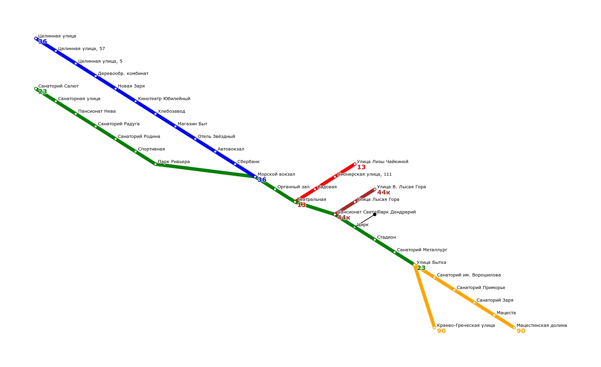
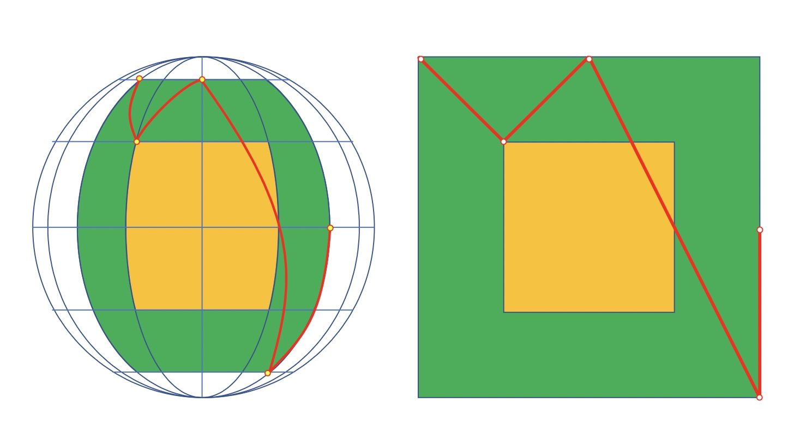
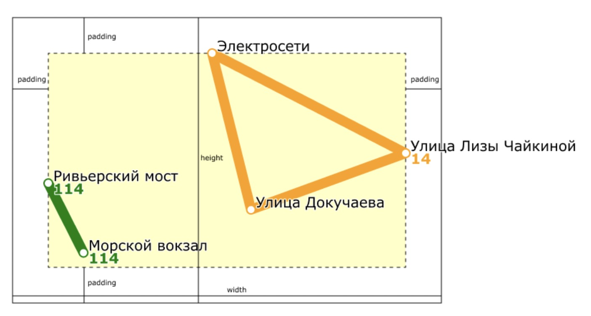
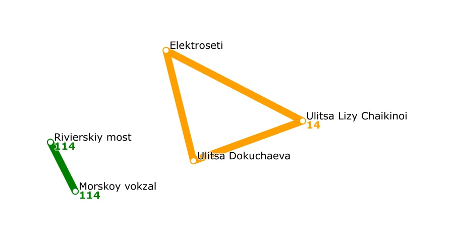

# Transport Catalogue

# Проект "Транспортный справочник"

Программа предназначена для создания базы данных автобусных маршрутов, получения информации об остановках и маршрутах, поиска кратчайшего пути между остановками и постороения графической карты в формате SVG.

Программа сможет создать подобную схему маршрутов:

## Разделы документации

- Работа программы
    - Программа make_base
    - Программа process_requests
    - Примеры работы программы
- Ввод/вывод
    - Структура входного JSON
        - Описание базы маршрутов
        - Настройки маршрутизации
        - Настройки отрисовки
        - Настройки сериализации
    - Запросы к базе данных
        - Получение информации о маршруте
        - Получение информации об остановке
        - Построение маршрута
        - Построение SVG-карты
    - Структура выходного JSON
        - Получение информации о маршруте
        - Получение информации об остановке
        - Построение маршрута
        - Построение SVG-карты
- Детали реализации
    - База данных транспортных маршрутов
    - JSON
        - JSON Builder
    - Визуализация карты маршрутов (SVG)
    - Построение оптимальных маршрутов
    - Сериализация и десериализация базы дынных
- Сборка и установка

## Работа программы

Программа разделена на 2 этапа, которые отвечают за наполнение транспортного справочника и обработку запросов к нему:
- Программа **make_base**: создание базы транспортного справочника по запросам **base_requests** и её сериализация в файл.
- Программа **process_requests**: десериализация базы из файла и использование её для ответов на запросы **stat_requests**.

### Программа make_base

На вход программе **make_base** через стандартный поток ввода подаётся JSON со следующими ключами:
- **base_requests**: запросы *Bus* и *Stop* на создание базы;
- **routing_settings**: настройки маршрутизации;
- **render_settings**: настройки отрисовки;
- **serialization_settings**: настройки сериализации.

Задача программы **make_base** — построить базу и сериализовать её в файл с указанным именем. Сериализованный файл содержит транспортный граф и данные, необходимые для быстрого построения кратчайших путей в нём.

### Программа process_requests

На вход программе **process_requests** подаётся файл с сериализованной базой (результат работы **make_base**), а также — через стандартный поток ввода — JSON со следующими ключами:
- **stat_requests**: запросы *Bus*, *Stop*, *Map* и *Route* к готовой базе.
- **serialization_settings**: настройки сериализации в формате, аналогичном этой же секции на входе **make_base**.

Программа **process_requests** выводит JSON с ответами на запросы.

**Примечание:**

Входной *JSON* может быть отформатирован произвольным образом: использовать или не использовать пробелы для отступов, ключи объектов могут быть расположены в разных строках или в одной. Иными словами, разделительные пробелы, табуляции и символы перевода строки внутри *JSON* могут располагаться произвольным образом или вообще отсутствовать.

***

### Пример 1
- [ввод **make_base**](./docs-sourses/examples-in-out/two-stage-make-base-1.json);
- [ввод **process_requests**](./docs-sourses/examples-in-out/two-stage-process-requests-1.json);
- [вывод **process_requests**](./docs-sourses/examples-in-out/two-stage-output-1.json).

### Пример 2
- [ввод **make_base**](./docs-sourses/examples-in-out/two-stage-make-base-2.json);
- [ввод **process_requests**](./docs-sourses/examples-in-out/two-stage-process-requests-2.json);
- [вывод **process_requests**](./docs-sourses/examples-in-out/two-stage-output-2.json).

***

## Ввод/вывод
### Структура входного JSON

#### Описание базы маршрутов

Массив **base_requests** содержит элементы двух типов: маршруты и остановки. Они перечисляются в произвольном порядке.

##### Пример описания остановки:

    {
        "type": "Stop",
        "name": "Электросети",
        "latitude": 43.598701,
        "longitude": 39.730623,
        "road_distances": {
            "Улица Докучаева": 3000,
            "Улица Лизы Чайкиной": 4300
        }
    }

Описание остановки — словарь с ключами:
- *type* — строка, равная "Stop". Означает, что словарь описывает остановку;
- *name* — название остановки;
- *latitude* и *longitude* — широта и долгота остановки — числа с плавающей запятой;
- *road_distances* — словарь, задающий дорожное расстояние от этой остановки до соседних. Каждый ключ в этом словаре — название соседней остановки, значение — целочисленное расстояние в метрах.

##### Пример описания автобусного маршрута:

    {
        "type": "Bus",
        "name": "14",
        "stops": [
            "Улица Лизы Чайкиной",
            "Электросети",
            "Улица Докучаева",
            "Улица Лизы Чайкиной"
        ],
        "is_roundtrip": true
    }
    
Описание автобусного маршрута — словарь с ключами:
- *type* — строка "Bus". Означает, что словарь описывает автобусный маршрут;
- *name* — название маршрута;
- *stops* — массив с названиями остановок, через которые проходит маршрут. У кольцевого маршрута название последней остановки дублирует название первой. Например: ["stop1", "stop2", "stop3", "stop1"];
- *is_roundtrip* — значение типа bool. true, если маршрут кольцевой.

#### Настройки маршрутизации

Ключ **routing_settings**, значение которого — словарь с двумя ключами:
- **bus_wait_time** — время ожидания автобуса на остановке, в минутах. Считайте, что когда бы человек ни пришёл на остановку и какой бы ни была эта остановка, он будет ждать любой автобус в точности указанное количество минут. Значение — целое число от 1 до 1000.
- **bus_velocity** — скорость автобуса, в км/ч. Считайте, что скорость любого автобуса постоянна и в точности равна указанному числу. Время стоянки на остановках не учитывается, время разгона и торможения тоже. Значение — вещественное число от 1 до 1000.

    "routing_settings": {
        "bus_wait_time": 6,
        "bus_velocity": 40
    }

Данная конфигурация задаёт время ожидания, равным 6 минутам, и скорость автобусов, равной 40 километрам в час.

Данная информация нужна для постороения маршрутов между двумя остановками - в запросах *Route* в списке **stat_requests**.

#### Настройки отрисовки

Чтобы управлять визуализацией карты, во входном JSON-документе подается словарь **render_settings**.

    {
        "width": 1200.0,
        "height": 1200.0,
    
        "padding": 50.0,
        
        "line_width": 14.0,
        "stop_radius": 5.0,

        "bus_label_font_size": 20,
        "bus_label_offset": [7.0, 15.0],

        "stop_label_font_size": 20,
        "stop_label_offset": [7.0, -3.0],
        
        "underlayer_color": [255, 255, 255, 0.85],
        "underlayer_width": 3.0,

        "color_palette": [
        "green",
            [255, 160, 0],
            "red"
        ]
    }

Структура словаря render_settings:
- **width** и **height** — ширина и высота изображения в пикселях. Вещественное число в диапазоне от 0 до 100000.
- **padding** — отступ краёв карты от границ SVG-документа. Вещественное число не меньше 0 и меньше *min(width, height)/2*.
- **line_width** — толщина линий, которыми рисуются автобусные маршруты. Вещественное число в диапазоне от 0 до 100000.
- **stop_radius** — радиус окружностей, которыми обозначаются остановки. Вещественное число в диапазоне от 0 до 100000.
- **bus_label_font_size** — размер текста, которым написаны названия автобусных маршрутов. Целое число в диапазоне от 0 до 100000.
- **bus_label_offset** — смещение надписи с названием маршрута относительно координат конечной остановки на карте. Массив из двух элементов типа *double*. Задаёт значения свойств *dx* и *dy* SVG-элемента *<text>*. Элементы массива — числа в диапазоне от –100000 до 100000.
- **stop_label_font_size** — размер текста, которым отображаются названия остановок. Целое число в диапазоне от 0 до 100000.
- **stop_label_offset** — смещение названия остановки относительно её координат на карте. Массив из двух элементов типа double. Задаёт значения свойств *dx* и *dy* SVG-элемента *<text>*. Числа в диапазоне от –100000 до 100000.
- **underlayer_color** — цвет подложки под названиями остановок и маршрутов. Формат хранения цвета будет ниже.
- **underlayer_width** — толщина подложки под названиями остановок и маршрутов. Задаёт значение атрибута *stroke-width* элемента *<text>*. Вещественное число в диапазоне от 0 до 100000.
- **color_palette** — цветовая палитра. Непустой массив.

Цвет можно указать в одном из следующих форматов:
- в виде строки, например, *"red"* или *"black"*;
- в массиве из трёх целых чисел диапазона [0, 255]. Они определяют *r*, *g* и *b* компоненты цвета в формате *svg::Rgb*. Цвет [255, 16, 12] нужно вывести в SVG как *rgb(255,16,12)*;
- в массиве из четырёх элементов: три целых числа в диапазоне от [0, 255] и одно вещественное число в диапазоне от [0.0, 1.0]. Они задают составляющие *red*, *green*, *blue* и *opacity* цвета формата *svg::Rgba*. Цвет, заданный как [255, 200, 23, 0.85], должен быть выведен в SVG как *rgba(255,200,23,0.85)*.

#### Настройки сериализации

На текущий момент это словарь с единственным ключом *file*, которому соответствует строка — название файла. Именно в этот файл программа сохранит сериализованную базу.

    "serialization_settings": {
        "file": "transport_catalogue.db"
    }
    
### Запросы к базе данных

Массив **stat_requests** содержит в себе запросы четырех видов (Stop, Bus, Route и Map) к готовой базе данных.

Каждый запрос — словарь с обязательными ключами *id* и *type*. Они задают уникальный числовой идентификатор запроса и его тип. В словаре могут быть и другие ключи, специфичные для конкретного типа запроса.

#### Получение информации о маршруте

Формат запроса:

    {
        "id": 12345678,
        "type": "Bus",
        "name": "14"
    }
    
- Ключ type имеет значение “Bus”. По нему можно определить, что это запрос на получение информации о маршруте.
- Ключ name задаёт название маршрута, для которого приложение должно вывести статистическую информацию.

#### Получение информации об остановке

Формат запроса:

    {
        "id": 12345,
        "type": "Stop",
        "name": "Улица Докучаева"
    }
    
Ключ name задаёт название остановки.

#### Построение маршрута

Запрос *Route* — это запросы на построение маршрута между двумя остановками. Помимо стандартных свойств id и type, они содержат ещё два:
- from — остановка, где нужно начать маршрут.
- to — остановка, где нужно закончить маршрут.

Оба значения — названия существующих в базе остановок. Однако они, возможно, не принадлежат ни одному автобусному маршруту.

    {
        "type": "Route",
        "from": "Biryulyovo Zapadnoye",
        "to": "Universam",
        "id": 4
    }

#### Построение SVG-карты

Запрос **Map** на получение изображения имеет следующий вид: 

    {
        "type": "Map",
        "id": 11111
    } 

### Структура выходного JSON

Итоговый JSON - это массив ответов на запросы **stat_requests** программы **process_requests**.

Ответы на запросы программа должна вывести в stdout в виде JSON-массива:

    [
        { ответ на первый запрос },
        { ответ на второй запрос },
        ...
        { ответ на последний запрос }
    ]

В выходном JSON-массиве на каждый запрос stat_requests должен быть ответ в виде словаря с обязательным ключом request_id. Значение ключа должно быть равно id соответствующего запроса. В словаре возможны и другие ключи, специфичные для конкретного типа ответа.
Порядок следования ответов на запросы в выходном массиве должен совпадать с порядком запросов в массиве stat_requests.

#### Получение информации о маршруте

Ответ на запрос **Bus** должен быть дан в виде словаря:

    {
        "curvature": 2.18604,
        "request_id": 12345678,
        "route_length": 9300,
        "stop_count": 4,
        "unique_stop_count": 3
    }
    
Ключи словаря:
- curvature — извилистость маршрута. Она равна отношению длины дорожного расстояния маршрута к длине географического расстояния. Число типа double;
- request_id — должен быть равен id соответствующего запроса Bus. Целое число;
- route_length — длина дорожного расстояния маршрута в метрах, целое число;
- stop_count — количество остановок на маршруте;
- unique_stop_count — количество уникальных остановок на маршруте.

Например, на кольцевом маршруте с остановками A, B, C, A четыре остановки. Три из них уникальные.
На некольцевом маршруте с остановками A, B и C пять остановок (A, B, C, B, A). Три из них уникальные.
Если в справочнике нет маршрута с указанным названием, ответ должен быть таким:

    {
        "request_id": 12345678,
        "error_message": "not found"
    }

#### Получение информации об остановке

Ответ на запрос **Stop**:

    {
        "buses": [
            "14", "22к"
        ],
        "request_id": 12345
    }
    
Значение ключей ответа:
- buses — массив названий маршрутов, которые проходят через эту остановку. Названия отсортированы в лексикографическом порядке.
- request_id — целое число, равное id соответствующего запроса Stop.

Если в справочнике нет остановки с переданным названием, ответ на запрос должен быть такой:

    {
        "request_id": 12345,
        "error_message": "not found"
    }

#### Построение маршрута

Ответ на запрос *Route* устроен следующим образом:

    {
        "request_id": <id запроса>,
        "total_time": <суммарное время>,
        "items": [
            <элементы маршрута>
        ]
    }

*total_time* — суммарное время в минутах, которое требуется для прохождения маршрута, выведенное в виде вещественного числа.
Обратите внимание, что расстояние от остановки A до остановки B может быть не равно расстоянию от B до A!
*items* — список элементов маршрута, каждый из которых описывает непрерывную активность пассажира, требующую временных затрат. А именно элементы маршрута бывают двух типов.

1. *Wait* — подождать нужное количество минут (в нашем случае всегда *bus_wait_time*) на указанной остановке:

    {
        "type": "Wait",
        "stop_name": "Biryulyovo",
        "time": 6
    }

2. *Bus* — проехать span_count остановок (перегонов между остановками) на автобусе *bus*, потратив указанное количество минут:

    {
        "type": "Bus",
        "bus": "297",
        "span_count": 2,
        "time": 5.235
    } 

Если маршрута между указанными остановками нет, результат выводится в следующем формате:

    {
        "request_id": <id запроса>,
        "error_message": "not found"
    }

#### Построение SVG-карты

Ответ на запрос **Map** отдаётся в виде словаря с ключами request_id и map:

    {
        "map": "<?xml version=\"1.0\" encoding=\"UTF-8\" ?>\n<svg xmlns=\"http://www.w3.org/2000/svg\" version=\"1.1\">\n  <polyline points=\"100.817,170 30,30 100.817,170\" fill=\"none\" stroke=\"green\" stroke-width=\"14\" stroke-linecap=\"round\" stroke-linejoin=\"round\"/>\n  <text fill=\"rgba(255,255,255,0.85)\" stroke=\"rgba(255,255,255,0.85)\" stroke-width=\"3\" stroke-linecap=\"round\" stroke-linejoin=\"round\" x=\"100.817\" y=\"170\" dx=\"7\" dy=\"15\" font-size=\"20\" font-family=\"Verdana\" font-weight=\"bold\">114</text>\n  <text fill=\"green\" x=\"100.817\" y=\"170\" dx=\"7\" dy=\"15\" font-size=\"20\" font-family=\"Verdana\" font-weight=\"bold\">114</text>\n  <text fill=\"rgba(255,255,255,0.85)\" stroke=\"rgba(255,255,255,0.85)\" stroke-width=\"3\" stroke-linecap=\"round\" stroke-linejoin=\"round\" x=\"30\" y=\"30\" dx=\"7\" dy=\"15\" font-size=\"20\" font-family=\"Verdana\" font-weight=\"bold\">114</text>\n  <text fill=\"green\" x=\"30\" y=\"30\" dx=\"7\" dy=\"15\" font-size=\"20\" font-family=\"Verdana\" font-weight=\"bold\">114</text>\n  <circle cx=\"100.817\" cy=\"170\" r=\"5\" fill=\"white\"/>\n  <circle cx=\"30\" cy=\"30\" r=\"5\" fill=\"white\"/>\n  <text fill=\"rgba(255,255,255,0.85)\" stroke=\"rgba(255,255,255,0.85)\" stroke-width=\"3\" stroke-linecap=\"round\" stroke-linejoin=\"round\" x=\"100.817\" y=\"170\" dx=\"7\" dy=\"-3\" font-size=\"20\" font-family=\"Verdana\">Морской вокзал</text>\n  <text fill=\"black\" x=\"100.817\" y=\"170\" dx=\"7\" dy=\"-3\" font-size=\"20\" font-family=\"Verdana\">Морской вокзал</text>\n  <text fill=\"rgba(255,255,255,0.85)\" stroke=\"rgba(255,255,255,0.85)\" stroke-width=\"3\" stroke-linecap=\"round\" stroke-linejoin=\"round\" x=\"30\" y=\"30\" dx=\"7\" dy=\"-3\" font-size=\"20\" font-family=\"Verdana\">Ривьерский мост</text>\n  <text fill=\"black\" x=\"30\" y=\"30\" dx=\"7\" dy=\"-3\" font-size=\"20\" font-family=\"Verdana\">Ривьерский мост</text>\n</svg>",
        "request_id": 11111
    } 
    
Ключ map — строка с изображением карты в формате SVG. Следующие спецсимволы при выводе строк в JSON нужно экранировать:
- двойные кавычки ";
- обратный слэш \\;
- символы возврата каретки и перевода строки.

***

Примечание: порядок вывода ключей, находящихся в словаре, может быть произвольным.

## Детали реализации

Основная структура программы организована в виде следующих модулей:
- [**geo**]() — объявляет координаты на земной поверхности и вычисляет расстояние между ними;
- [**domain**]() — классы основных сущностей, описывают автобусы и остановки;
- [**transport_catalogue**]() — модуль транспортного каталога;
- [**request_handler**]() — обрабатывает запросы. Играет роль Фасада, который упрощает взаимодействие с транспортным каталогом;
- [**renderer**]() - визуализация маршрутов;
- [**graph**]() - реализация графа для построения оптимальных маршрутов;
- [**transport_router**]() - реализация маршрутизатора;
- [**serialization**]() - реализация логики сериализации и десериализации базы данных;
- [**json**]() — библиотека для парсинга и вывода JSON;
- [**svg**]() - библиотека SVG для построения карты маршрутов;
- [**reader**]() — выполняет разбор JSON-данных, построенных в ходе парсинга, и формирует массив JSON-ответов;

### База данных транспортных маршрутов

Система хранения транспортных маршрутов реализована в классе *TransportCatalogue*, имеющем методы для выполнения следующих задач:
- [**Добавление маршрута в базу**]();
- [**Добавление остановки в базу**]();
- [**Поиск маршрута по имени**]();
- [**Поиск остановки по имени**]();
- [**Получение информации о маршруте**]();
- [**Получение информации об остановке**]();
- [**Получение ссылки на дек всех маршрутов**]();
- [**Получение ссылки на дек всех остановок**]();
- [**Получение отсортированного массива всех маршрутов**]();
- [**Получение отсортированного массива всех остановок**]();
- [**Получение значений координат всех существующих остановок**]();
- [**Получение индексов маршрутов**]();
- [**Получение дистанции между остановками**]();

В классе транспортного справочника используются индексы для поиска автобусов и остановок по имени. В качестве значений используются константные указатели: *const Bus*\* и *const Stop*\*, где *Bus* и *Stop* — название структур для маршрута и остановки соответственно.

В проекте предпочтение отдается *std::unordered_set* и *std::unordered_map* - упорядоченным контейнерам, чтобы достичь требуемой вычислительной сложности операций вставки и поиска.

Сами остановки и автобусы хранится в *std::deque*, чтобы ссылки и указатели на них не инвалидировались при добавлении.

### JSON

Ввод и вывод программы основан на JSON.

В файлах [*json.h*]() и [*json.cpp*]() располагается библитека для парсинга JSON.

Класс [**Node**]() должен хранить значения одного из следующих типов:
- Целые числа типа *int*.
- Вещественные числа типа *double*.
- Строки — тип *std::string*.
- Логический тип *bool*.
- Массивы:

    using Array = std::vector<Node>; 

- Словари:

    using Dict = std::map<std::string, Node>;
  
    
    
- *std::nullptr_t*. Используется, чтобы представить значение **null** в JSON документе. Кроме std::nullptr_t можно было бы также использовать тип *std::monostate*, однако *std::nullptr_t* кажется более подходящим по смыслу для представления **null**.

Следующие методы **Node** сообщают, хранится ли внутри значение некоторого типа:
- *bool IsInt() const*;
- *bool IsDouble() const*; Возвращает *true*, если в **Node** хранится *int* либо *double*.
- *bool IsPureDouble() const*; Возвращает *true*, если в **Node** хранится *double*.
- *bool IsBool() const*;
- *bool IsString() const*;
- *bool IsNull() const*;
- *bool IsArray() const*;
- *bool IsMap() const*;

Ниже перечислены методы, которые возвращают хранящееся внутри **Node** значение заданного типа. Если внутри содержится значение другого типа, должно выбрасываться исключение *std::logic_error*.
- *int AsInt() const*;
- *bool AsBool() const*;
- *double AsDouble() const*;. Возвращает значение типа *double*, если внутри хранится *double* либо *int*. В последнем случае возвращается приведённое в *double* значение.
- *const std::string& AsString() const*;
- *const Array& AsArray() const*;
- *const Map& AsMap() const*;

Объекты **Node** можно сравнивать между собой при помощи == и !=. Значения равны, если внутри них значения имеют одинаковый тип и содержимое.

При загрузке невалидных JSON-документов выбрасывается исключение *json::ParsingError*.

При загрузке и сохранении строк поддерживаются следующие escape-последовательности: \n, \r, \\", \t, \\\\.

#### JSON Builder

Класс [**json::Builder**](), позволяющий сконструировать JSON-объект, используя цепочки вызовов методов. Этот класс основан на библиотеке JSON, описанной выше.

Начнём с простого примера — объекта-строки:

    json::Builder{}.Value("just a string"s).Build() 

Это выражение должно быть объектом **json::Node** и содержать указанную строку. Вывести построенный JSON, как и раньше, можно так:

    json::Print(
        json::Document{
            json::Builder{}
            .Value("just a string"s)
            .Build()
        },
        std::cout
    );
    
Вывод:

    "just a string" 
    
Более сложный пример демонстрирует все методы builder-класса на более сложном JSON-объекте:

    json::Print(
        json::Document{
                    // Форматирование не имеет формального значения:
                    // это просто цепочка вызовов методов
            json::Builder{}
            .StartDict()
                .Key("key1"s).Value(123)
                .Key("key2"s).Value("value2"s)
                .Key("key3"s).StartArray()
                    .Value(456)
                    .StartDict().EndDict()
                    .StartDict()
                        .Key(""s).Value(nullptr)
                    .EndDict()
                    .Value(""s)
                .EndArray()
            .EndDict()
            .Build()
        },
        std::cout
    ); 

Вывод:

    {
        "key1": 123,
        "key2": "value2",
        "key3": [
            456,
            {
            
            },
            {
                "": null
            },
            ""
        ]
    }

Разберём все методы класса **json::Builder**. Ниже описана их семантика, и для понимания дан контекст, в котором они вызываются.
- *Key(std::string)*. При определении словаря задаёт строковое значение ключа для очередной пары ключ-значение. Следующий вызов метода обязательно должен задавать соответствующее этому ключу значение с помощью метода *Value* или начинать его определение с помощью *StartDict* или *StartArray*.
- *Value(Node::Value)*. Задаёт значение, соответствующее ключу при определении словаря, очередной элемент массива или, если вызвать сразу после конструктора **json::Builder**, всё содержимое конструируемого JSON-объекта. Может принимать как простой объект — число или строку — так и целый массив или словарь. Здесь *Node::Value* — это синоним для базового класса *Node*, шаблона *std::variant* с набором возможных типов-значений.
- *StartDict()*. Начинает определение сложного значения-словаря. Вызывается в тех же контекстах, что и *Value*. Следующим вызовом обязательно должен быть *Key* или *EndDict*.
- *StartArray()*. Начинает определение сложного значения-массива. Вызывается в тех же контекстах, что и *Value*. Следующим вызовом обязательно должен быть *EndArray* или любой, задающий новое значение: *Value*, *StartDict* или *StartArray*.
- *EndDict()*. Завершает определение сложного значения-словаря. Последним незавершённым вызовом *Start\** должен быть *StartDict*.
- *EndArray()*. Завершает определение сложного значения-массива. Последним незавершённым вызовом *Start*\* должен быть *StartArray*.
- *Build()*. Возвращает объект *json::Node*, содержащий JSON, описанный предыдущими вызовами методов. К этому моменту для каждого *Start\** должен быть вызван соответствующий *End*\*. При этом сам объект должен быть определён, то есть вызов **json::Builder{}.Build()** недопустим.
- Возвращаемое значение каждого метода, кроме *Build*, должно быть *Builder&*.

##### Обработка ошибок

Методы класса имеют амортизированную линейную сложность относительно размера входных данных. Исключение — дополнительный логарифмический множитель при добавлении в словарь.

Некоторые явные ошибки обнаруживаются на этапе компиляции, а не выбрасываются в виде исключений при запуске программы.

Код json::Builder не должен компилироваться в следующих ситуациях:
1. Непосредственно после Key вызван не Value, не StartDict и не StartArray.
2. После вызова Value, последовавшего за вызовом Key, вызван не Key и не EndDict.
3. За вызовом StartDict следует не Key и не EndDict.
4. За вызовом StartArray следует не Value, не StartDict, не StartArray и не EndArray.
5. После вызова StartArray и серии Value следует не Value, не StartDict, не StartArray и не EndArray.

Примеры кода, которые не должны компилироваться:

    json::Builder{}.StartDict().Build();  // правило 3
    json::Builder{}.StartDict().Key("1"s).Value(1).Value(1);  // правило 2
    json::Builder{}.StartDict().Key("1"s).Key(""s);  // правило 1
    json::Builder{}.StartArray().Key("1"s);  // правило 4
    json::Builder{}.StartArray().EndDict();  // правило 4
    json::Builder{}.StartArray().Value(1).Value(2).EndDict();  // правило 5

Эта задача решается возвратом специальных вспомогательных классов, допускающих определённые наборы методов.

В случае использования методов в неверном контексте код выбросывает исключение типа *std::logic_error* с понятным сообщением об ошибке.
Это происходит в следующих ситуациях:
- Вызов некорректного метода сразу после создания json::Builder.
- Вызов некорректного метода после End*.

### Визуализация карты маршрутов (SVG)

Планета Земля имеет форму геоида, но чтобы упростить вычисления, в программе она считается идеальной сферой радиусом 6371 километр. Эти допущения отражены в функции geo::ComputeDistance. Она вычисляет географическое расстояние между двумя точками земной поверхности.

Координаты на земной поверхности задаются широтой и долготой и измеряются в градусах. Экран монитора, на котором нужно нарисовать карту — плоский. Координаты на нём задаются в пикселях. Поэтому прежде чем нарисовать карту, надо преобразовать координаты остановок — ключевых точек карты — из градусов в пиксели. Такое преобразование координат называется «проецирование сферы на плоскость».

Чтобы спроецировать координаты остановок на карту, сначала нужно определить, в каком диапазоне географических координат располагаются остановки. Затем преобразовать географические координаты в плоские. При преобразовании сферических координат в плоские будут искажаться форма и размеры объектов.

Чем больше проецируемая область и чем ближе объект находится к полюсу, тем заметнее искажения. Например, Гренландия на карте мира кажется больше Индии, хотя имеет в полтора раза меньшую площадь. На карте города эти искажения будут незначительны, так как размеры городов во много раз меньше размеров Земли, да и вблизи северного и южного полюсов населённых пунктов нет.

На рисунке зелёным цветом выделен участок, внутри которого находятся ключевые точки маршрута. Оранжевая область расположена близко к экватору и искажена меньше зелёной.
Представленный ниже алгоритм проецирования использует долготу и широту остановок в качестве координат x и y. Он масштабирует их так, чтобы вписать в прямоугольник шириной **width - 2 * padding** и высотой **height - 2 * padding**.
- width и height задают ширину и высоту карты в пикселях,
- padding задаёт отступ краёв карты от границ SVG документа и также измеряется в пикселях.

Класс [**SphereProjector**]() проецирует точки на плоскость для этих нужд.

Модули, отвечающие за отрисовку карты маршрутов:
- svg — в нем находится SVG-библиотека;
- map_renderer — отвечает за визуализацию карты.

***

Следующий JSON документ содержит описание пяти остановок и двух маршрутов, а также настройки, управляющие визуализацией карты. Алгоритм рисования карты рассматривается на примере этого документа:

[**Пример входных данных**](./docs-sourses/examples-in-out/rendering-example-1.json)

#### Определение цвета маршрута

Из палитры *color_palette* выбираются цвета линий в соответствии с лексикографическим порядком названий маршрутов: первый по алфавиту маршрут должен получить первый цвет, второй маршрут — второй цвет и так далее. Если маршрутов больше, чем цветов в палитре, цвета переиспользуются по циклу. Например, когда маршрутов десять, а цветов три, первый цвет будет у первого, четвёртого, седьмого и десятого маршрута.

Если на маршруте нет остановок, следующий за ним маршрут должен использовать в палитре тот же индекс. Допустим, маршрутов десять, и у четвёртого остановок нет. Цветов в палитре три. Тогда первый цвет получат первый, пятый и восьмой автобусы.

В приведённом JSON-документе объявлены два маршрута: “14” и “114”. В лексикографическом порядке строка “114” предшествует “14”, поэтому маршрут “114” будет иметь цвет green, а “14” — *rgb(255,160,0)* (оттенок оранжевого цвета).

#### Отрисовка линий маршрутов

Линии маршрутов выводятся в виде ломаной линии, соединяющей остановки. Порядок рисования: по возрастанию названий маршрутов. Линии маршрутов, на которых нет остановок, не рисуются.
Свойства линий:
- Цвет линии *stroke* определён по правилам выше;
- Цвет заливки *fill* должен иметь значение none;
- Толщина линии *stroke-width* равна настройке *line_width*;
- Формы конца линии *stroke-linecap* и соединений *stroke-linejoin* равны round.

Вершины каждой ломаной — это координаты соответствующих остановок. Они выводятся в порядке следования от первой до первой остановки по кольцевому маршруту. Для проецирования координат остановок на SVG-карту используется класс **SphereProjector**. Количество вершин равно величине *stop_count* из ответа на запрос *Bus*. Если маршрут некольцевой, то есть *"is_roundtrip": false*, каждый отрезок между соседними остановками будет нарисован дважды: сначала в прямом, а потом в обратном направлении.

Для JSON из примера сначала зелёным цветом рисуется маршрут “114”. Он некольцевой, поэтому его тег *<polyline>* задаёт ломаную линию из трёх узлов: начальная остановка “Morskoy vokzal” с координатами (99.2283, 329.5), затем конечная “Riviersiy most” с координатами (50, 232.18) и снова начальная “Morskoy vokzal”.

Вторым выводится маршрут “14” оранжевого цвета. Он кольцевой, поэтому тег *<polyline>* начинается в остановке “Ulitsa Lizy Chaikinoi”, проходит через “Elektroseti” и “Ulitsa Dokuchaeva” и возвращается в “Ulitsa Lizy Chaikinoi”.

#### Названия маршрутов

Название маршрута отрисовывается у каждой из его конечных остановок. В кольцевом маршруте — когда *"is_roundtrip": true* — конечной считается первая остановка маршрута. А в некольцевом — первая и последняя.

Названия маршрутов рисуются в алфавитном порядке. Для каждого маршрута сначала выводится название для его первой конечной остановки, а затем, если маршрут некольцевой и конечные не совпадают, — для второй конечной.

Если остановок у маршрута нет, его название не выводится.

Для каждого названия у конечной выводятся два текстовых объекта: подложка и сама надпись.

Общие свойства обоих объектов:
- *x* и *y* — координаты соответствующей остановки;
- смещение *dx* и *dy* равно настройке *bus_label_offset*;
- размер шрифта *font-size* равен настройке *bus_label_font_size*;
- название шрифта *font-family* — "Verdana";
- толщина шрифта *font-weight* — "bold".
- содержимое — название автобуса.

Дополнительные свойства подложки:
- цвет заливки *fill* и цвет линий *stroke* равны настройке *underlayer_color*;
- толщина линий *stroke-width* равна настройке *underlayer_width*;
- формы конца линии *stroke-linecap* и соединений *stroke-linejoin* равны round.

Дополнительное свойство самой надписи:
- Цвет заливки *fill* равен цвету соответствующего автобусного маршрута из палитры.

#### Символы остановок

Каждая остановка маршрута изображается на карте в виде кружочков белого цвета. Их нужно отрисовать для всех маршрутов, где есть остановки. Одна остановка — один кружочек. Они выводятся по одному в порядке возрастания названия остановки, независимо от количества маршрутов, которые через неё проходят. Остановки, через которые не проходит ни один автобус, не выводятся.

Атрибуты окружности:
- координаты центра *cx* и *cy* — координаты соответствующей остановки на карте;
- радиус *r* равен настройке *stop_radius* из словаря *render_settings*;
- цвет заливки *fill* — "white".

#### Названия остановок

Названия остановок выводятся в лексикографическом порядке, под одному на каждую остановку, независимо от количества автобусов, которые через неё проходят. Названия остановок, через которые не проходит ни один маршрут, отрисовывать не надо.

Для каждой остановки выведите два текстовых объекта: подложку и саму надпись.

Общие свойства обоих объектов:
- *x* и *y* — координаты соответствующей остановки;
- смещение *dx* и *dy* равно настройке *stop_label_offset*;
- размер шрифта *font-size* равен настройке *stop_label_font_size*;
- название шрифта *font-family* — "Verdana";
- свойства *font-weight* быть не должно;
- содержимое — название остановки.

Дополнительные свойства подложки:
- цвет заливки *fill* и цвет линий *stroke* равны настройке *underlayer_color*;
- толщина линий *stroke-width* равна настройке *underlayer_width*;
- формы конца линии *stroke-linecap* и соединений *stroke-linejoin* равны "round".

Дополнительное свойство самой надписи:
- цвет заливки *fill* — "black".

Для JSON-документа из примера ожидаемый вывод такой:

[**Вывод**](./docs-sourses/examples-in-out/rendered-svg.txt)

Отрисовка:

### Построение оптимальных маршрутов

На маршруте человек может использовать несколько автобусов. Один автобус даже можно использовать несколько раз, если на некоторых участках он делает большой крюк и проще срезать на другом автобусе.

Маршрут должен быть наиболее оптимален по времени. Если маршрутов с минимально возможным суммарным временем несколько, допускается вывести любой из них: тестирующая система проверяет лишь совпадение времени маршрута с оптимальным и корректность самого маршрута.

При прохождении маршрута время расходуется на два типа активностей:
- Ожидание автобуса. Всегда длится *bus_wait_time* минут.
- Поездка на автобусе. Всегда длится ровно такое количество времени, которое требуется для преодоления данного расстояния со скоростью *bus_velocity*. Расстояние между остановками вычисляется по дорогам, то есть с использованием *road_distances*.

Ходить пешком, выпрыгивать из автобуса между остановками и использовать другие виды транспорта запрещается. На конечных остановках все автобусы высаживают пассажиров и уезжают в парк. Даже если человек едет на кольцевом — *"is_roundtrip": true* — маршруте и хочет проехать мимо конечной, он будет вынужден выйти и подождать тот же самый автобус ровно *bus_wait_time* минут. Этот и другие случаи разобраны в примерах.

Задача поиска оптимального маршрута данного вида сводится к задаче поиска кратчайшего пути во взвешенном ориентированном графе.

[**graph.h**]() — класс, реализующий взвешенный ориентированный граф,
[**router.h**]() — класс, реализующий поиск кратчайшего пути во взвешенном ориентированном графе.

Как часто бывает в реальной жизни разработчиков, обе эти библиотеки даны без документации, но с самодокументируемым кодом: интерфейсы представленных классов легко читаются по заголовкам публичных методов.

Информация о классах:
- Вершины и рёбра графа нумеруются автоинкрементно беззнаковыми целыми числами, хранящимися в типах VertexId и EdgeId: вершины нумеруются от нуля до количества вершин минус один в соответствии с пользовательской логикой. Номер очередного ребра выдаётся методом AddEdge; он равен нулю для первого вызова метода и при каждом следующем вызове увеличивается на единицу.
- Память, нужная для хранения графа, линейна относительно суммы количеств вершин и рёбер.
- Конструктор и деструктор графа имеют линейную сложность, а остальные методы константны или амортизированно константны.
- Маршрутизатор — класс Router — требует квадратичного относительно количества вершин объёма памяти, не считая памяти, требуемой для хранения кэша маршрутов.
Конструктор маршрутизатора имеет сложность O(V^3 + E), где V — количество вершин графа, E — количество рёбер.
- Маршрутизатор не работает с графами, имеющими рёбра отрицательного веса.
- Построение маршрута на готовом маршрутизаторе линейно относительно количества рёбер в маршруте. Таким образом, основная нагрузка построения оптимальных путей ложится на конструктор.

### Сериализация и десериализация базы дынных

В памяти программы данные существуют разрозненно — одни объекты ссылаются на другие. Что-то находится в динамической памяти, что-то в стеке, а что-то в сегменте. Одни данные организованы в виде деревьев, другие в линейном виде. В любой крупной программе возникает необходимость собрать эти разрозненные данные в единый набор байтов, чтобы сохранить или передать их. Примеры:
- Сохранение документа в редакторе,
- Сохранение состояния в компьютерной игре,
- Сохранение *JSON*, *XML*, *INI* или файла другого формата,
- Сохранение изображения,
- Передача информации по сети.

Процесс преобразования в последовательность байтов называется **сериализация**, а обратный процесс восстановления данных — **десериализация**.

**Google Protocol Buffers**, можно просто **Protobuf**. Широко применяемый протокол бинарной сериализации. Поддерживает самые разные языки, например C++, Python, Java и JavaScript. Данные могут быть сериализованы программой на C++, переданы по сети и на другом конце прочитаны программой на Python.

Формат описывается в файле с расширением .proto. Их ещё называют proto-схемами. Этот файл подаётся специальному компилятору, который создаст код на выбранном языке программирования, способный сохранять, читать и менять данные указанного формата.

Proto-файл определяет сообщение — совокупность значений, аналог структуры в C++.

Подробное описание устройства файлов Protobuf есть в [*документации*](https://protobuf.dev/programming-guides/proto3/) на сайте библиотеки.  Поддерживаются два различных синтаксиса: proto2 и proto3. В проекте используется только синтаксис proto3 как более современный.

Детали работы с **Protobuf** Вы можете найти в [*гайде*](https://protobuf.dev/getting-started/cpptutorial/) или [*описании API*](https://protobuf.dev/reference/cpp/cpp-generated/) в официальной документации.

### Сборка и установка

Для сборки проекта необходимо скачать Protobuf с [*репозитория на GitHub*](https://github.com/protocolbuffers/protobuf/releases). Выберите архив protobuf-cpp с исходным кодом последней версии и распакуйте его на своём компьютере. Исходный код содержит CMake-проект. Поместите его вместе со скаченным репозиторием проекта.

Также для успешной сборки требуется современный компилятор с поддержкой стандарта C++17 (К примеру, Clang или GCC).
